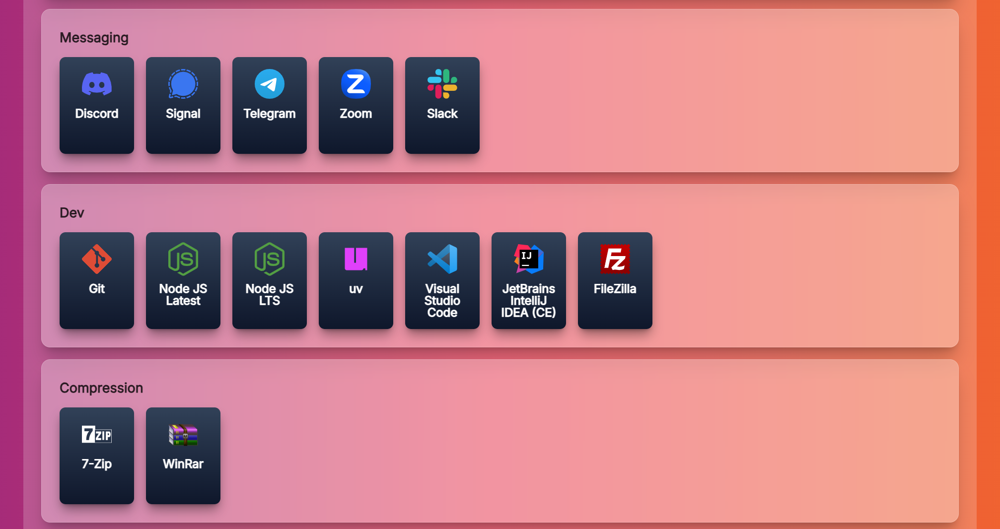

# Spinel

> A beautiful and fast script generator for Chocolatey, inspired by Ninite's elegant interface.

[](LICENSE)
[](https://nuxt.com/)
[](https://vuejs.org/)
[](https://tailwindcss.com/)

## ✨ Features

- **🎨 Beautiful Interface**: Modern, clean design with intuitive user experience
- **⚡ Fast Performance**: Built with Nuxt 4 and Tailwind.
- **📦 Chocolatey Integration**: Seamless script generation for package management
- **🔧 Customizable Options**: Flexible parameters for tailored script creation
- **📱 Responsive Design**: Works perfectly on desktop and mobile devices

## 📸 Preview



## 🛠️ Installation & Usage

1. Clone the repository:

   ```bash
   git clone https://github.com/Mateleo/spinel.git
   cd spinel
   ```

2. Install dependencies:

   ```bash
   pnpm install
   ```

3. Start the development server:

   ```bash
   pnpm dev
   ```

4. Open your browser and navigate to `http://localhost:3000`

## 📄 License

This project is licensed under the MIT License - see the [LICENSE](LICENSE) file for details.

---


